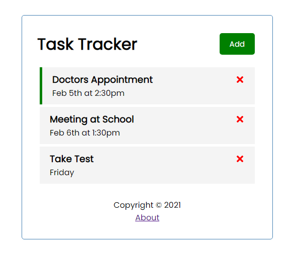

# React

Studying React and its basic principles

---

**React JS Crash Course 2021** (Traversy Media) -kurssi

https://www.youtube.com/watch?v=w7ejDZ8SWv8  
https://github.com/bradtraversy/react-crash-2021

- using Node.js to create and build React app
- using React Developer Tools for Chrome
- learning React (17.0.1) by building task tracker app and looking at components, props, state, hooks, working with API and more
- using [JSON Server](https://github.com/typicode/json-server) to build own REST API for task tracker app

Practice project (11.10.2021):

- [Task Tracker](../master/react-task-tracker) (React basics)  
  

---

**React Front To Back** (Brad Traversy/Udemy) -kurssi

React 16.8+ concepts including how to create a Flux pattern using the Context API with the useContext and useReducer hooks. Building 3 projects, including a full stack MERN application with a custom Express backend API that uses JWT (JSON Web Token) for authentication. Also a project that uses Redux.

Learning:

- React Fundamentals (Components, props, state, etc)
- Flux pattern & React Hooks (useState, useEffect, useContext, useReducer, useRef) in real projects
- Context API & App Level State
- full stack development with MERN - MongoDB, Express, React, Node
- Build a Custom API With JWT Authentication
- Redux - Reducers, Actions, etc
- Basic Animation

Practice projects:  
[Github Finder](../master/github-finder) (React basics)

- using [Github REST API](https://docs.github.com/en/rest)
- understanding class-based components (turn function-based with hooks), JSX, fragments, expressions & conditionals
- React folder structure
- components, props, state
- ENV variables
- HTTP Request/Response
- class/lifecycle
- functions/hooks
- Context API with useContext & useReducer

https://reactjs.org/docs/hello-world.html  
https://reactjs.org/tutorial/tutorial.html

https://github.com/bradtraversy/github-finder  
https://docs.github.com/en/rest  
https://github.com/settings/applications/new  
https://api.github.com/users  
https://api.github.com/search/users?q=brad  
https://api.github.com/users/bradtraversy  
https://api.github.com/users/bradtraversy/repos

Contact Keeper (MERN)

- Express backend API
- testing API with Postman
- JWT (JSON Web Token)
- MongoDB/Mongoose
- password encryption
- React Hooks
- Context API (Store JWT, etc)
- route protection

ITLogger (task tracker, Redux)

- Redux state management
- actions & reducers
- React-Redux
- Redux Thunk
- JSON-Server API
- Materialize UI (modals, toasts, etc)
